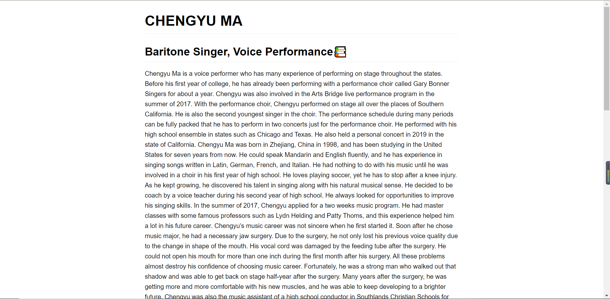

#	**CHENGYU MA**
##	Baritone Singer, Voice Performance📚

Chengyu Ma is a voice performer who has many experience of performing on stage throughout the states. Before his first year of college, he has already been performing with a performance choir called Gary Bonner Singers for about a year. Chengyu was also involved in the Arts Bridge live performance program in the summer of 2017. With the performance choir, Chengyu performed on stage all over the places of Southern California. He is also the second youngest singer in the choir. The performance schedule during many periods can be fully packed that he has to perform in two concerts just for the performance choir. He performed with his high school ensemble in states such as Chicago and Texas. He also held a personal concert in 2019 in the state of California.
Chengyu Ma was born in Zhejiang, China in 1998, and has been studying in the United States for seven years from now. He could speak Mandarin and English fluently, and he has experience in singing songs written in Latin, German, French, and Italian. He had nothing to do with his music until he was involved in a choir in his first year of high school. He loves playing soccer, yet he has to stop after a knee injury. As he kept growing, he discovered his talent in singing along with his natural musical sense. He decided to be coach by a voice teacher during his second year of high school. He always looked for opportunities to improve his singing skills. In the summer of 2017, Chengyu applied for a two weeks music program. He had master classes with some famous professors such as Lydn Helding and Patty Thoms, and this experience helped him a lot in his future career. Chengyu’s music career was not sincere when he first started it. Soon after he chose music major, he had a necessary jaw surgery. Due to the surgery, he not only lost his previous voice quality due to the change in shape of the mouth. His vocal cord was damaged by the feeding tube after the surgery. He could not open his mouth for more than one inch during the first month after his surgery. All these problems almost destroy his confidence of choosing music career. Fortunately, he was a strong man who walked out that shadow and was able to get back on stage half-year after the surgery. Many years after the surgery, he was getting more and more comfortable with his new muscles, and he was able to keep developing to a brighter future.
Chengyu was also the music assistant of a high school conductor in Southlands Christian Schools for three years. As he was working as a music assistant, he gained experience of planning trips, managing budgets, and conducting. He taught a few classes of choir as a music assistant. He was also involved in an album recording sponsored by that school, and he was the soloist for one of the songs on the album. Chengyu was also recognized by his students as a man who was kind, helpful, and cooperative.
[Linkedin](https://www.linkedin.com/feed/?trk=onboarding-landing) [Github](https://github.com/Chengyu-Ma) [Mail](mailto:cma029@ucr.edu)
##
#	EXPERIENCE
##	MUSICAL ACTOR
[University of California Riverside](https://www.ucr.edu/)

 - Soloist Acting
 - Acting

January 2019 - April 2019
##	MUSIC ASSISTANT
[Southlands Christian High School](https://southlandscs.com/)

 - Trip Planning
 - Budget Management
 - Conducting

August 2017 - Present

##	MUSIC WRITING
[University of California Riverside](https://www.ucr.edu/)

 - Writing music piece
 - Written music being played in classes

September 2019 - Present

#	EDUCATION
**UC RIVERSIDE
Bachelor of Arts, Music Performance**

# PORTFOLIO

> Written with [StackEdit](https://stackedit.io/).
> ##Synchronize a file